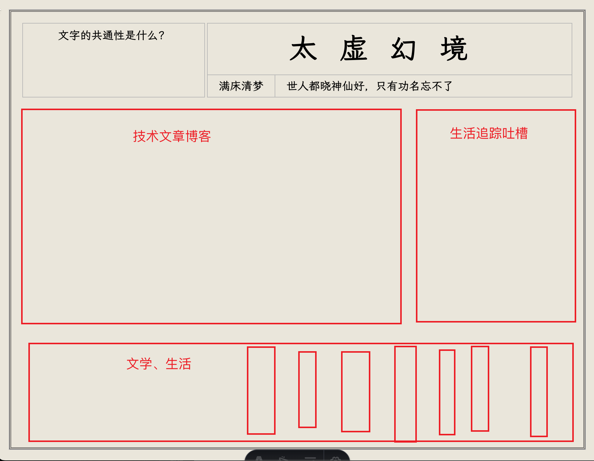

# 太虚幻境 🏮

<div align="center">



*"世人都晓神仙好，惟有功名忘不了！古今将相在何方？荒冢一堆草没了。"*

[](https://astro.build/)
[](https://www.typescriptlang.org/)
[](https://mdxjs.com/)

</div>

## 📖 项目简介

> **太虚幻境，贾宝玉在这个地方窥视了未来**。总需要磨蹭点事情才能打发这虚无的时间。我并非有大志之人，一切所做所想只是小儿家的情感意气。

这是一个基于 Astro 构建的个人博客网站，采用古典中式设计风格，致力于记录技术思考、文学感悟和生活随笔。网站以《红楼梦》中的"太虚幻境"为主题，寓意在虚无中寻找真实，在平凡中发现不凡。

## ✨ 功能特性

### 🎨 设计特色
- **古典中式风格**：采用传统的红黑配色和古典排版
- **响应式设计**：完美适配桌面端和移动端
- **优雅动画**：流畅的过渡效果和交互动画
- **自定义字体**：精心选择的中文字体排版

### 📝 内容管理
- **分类体系**：
  - 🔧 **技术类(tech)**：技术文章、编程心得、开发经验
  - 📚 **苟活类(novel)**：文学感悟、历史思考、人生随笔
- **标签系统**：支持多标签分类和筛选
- **MDX 支持**：支持在 Markdown 中使用 React 组件

### 🔍 搜索功能
- **全局搜索**：支持标题和标签的实时搜索
- **关键词高亮**：搜索结果中关键词自动高亮
- **防抖优化**：300ms 防抖，提升搜索体验
- **响应式界面**：全屏搜索面板，支持键盘操作

### 🚀 性能优化
- **静态生成**：基于 Astro 的静态站点生成
- **代码分割**：按需加载，优化首屏性能
- **图片优化**：自动图片压缩和格式转换
- **SEO 友好**：完善的 meta 标签和语义化 HTML

## 🛠️ 技术栈

- **框架**：[Astro](https://astro.build/) - 现代静态站点生成器
- **语言**：[TypeScript](https://www.typescriptlang.org/) - 类型安全的 JavaScript
- **内容**：[MDX](https://mdxjs.com/) - Markdown + JSX
- **样式**：原生 CSS + CSS 变量
- **代码高亮**：[Prism.js](https://prismjs.com/)
- **部署**：GitHub Pages

## 📁 项目结构

```
太虚幻境/
├── public/                 # 静态资源
│   ├── bg.svg             # 背景图案
│   ├── border-text.svg    # 边框装饰
│   └── home.png           # 首页图片
├── src/
│   ├── component/         # 组件
│   │   ├── quote.astro    # 引用组件
│   │   ├── tabs.astro     # 标签页组件
│   │   └── search.astro   # 搜索组件
│   ├── content/           # 内容集合
│   │   ├── config.ts      # 内容配置
│   │   ├── tech/          # 技术文章
│   │   └── novel/         # 文学随笔
│   ├── pages/             # 页面
│   │   ├── index.astro    # 首页
│   │   ├── [...path].astro # 动态路由
│   │   └── tags/          # 标签页面
│   └── styles/            # 样式文件
│       ├── global.css     # 全局样式
│       ├── index.css      # 首页样式
│       └── code-theme.css # 代码主题
├── astro.config.mjs       # Astro 配置
└── package.json           # 项目配置
```

## 🚀 快速开始

### 环境要求
- Node.js 18+ 
- npm 或 yarn

### 安装依赖
```bash
npm install
```

### 开发模式
```bash
npm run dev
```
访问 `http://localhost:4321` 查看网站

### 构建生产版本
```bash
npm run build
```

### 预览生产版本
```bash
npm run preview
```

## 📝 内容创作

### 添加技术文章
在 `src/content/tech/` 目录下创建 `.mdx` 文件：

```markdown
---
title: "文章标题"
tags: ["javascript", "前端", "编程"]
---

# 文章内容

这里是文章正文...
```

### 添加文学随笔
在 `src/content/novel/` 目录下创建 `.mdx` 文件：

```markdown
---
title: "随笔标题"
tags: ["生活", "感悟"]
---

# 随笔内容

这里是随笔正文...
```

## 🎨 自定义样式

网站使用 CSS 变量进行主题配置，主要变量定义在 `src/styles/global.css`：

```css
:root {
  --var_background-color: #ebe6da;  /* 背景色 */
  --var_red: #9b1b30;               /* 主题红色 */
  --var_pitch-black: #333333;       /* 文字黑色 */
  --var_off-white: #f5f5dc;         /* 米白色 */
}
```

## 🔍 搜索功能使用

1. 点击页面右上角的搜索图标 🔍
2. 在搜索框中输入关键词
3. 实时查看搜索结果
4. 点击结果跳转到对应文章
5. 按 ESC 键或点击外部区域关闭搜索

## 📱 响应式支持

- **桌面端**：瀑布流布局，多列显示
- **平板端**：自适应列数
- **移动端**：单列布局，优化触摸体验

## 🤝 贡献指南

欢迎提交 Issue 和 Pull Request！

1. Fork 本仓库
2. 创建特性分支 (`git checkout -b feature/AmazingFeature`)
3. 提交更改 (`git commit -m 'Add some AmazingFeature'`)
4. 推送到分支 (`git push origin feature/AmazingFeature`)
5. 开启 Pull Request

## 📄 许可证

本项目采用 MIT 许可证 - 查看 [LICENSE](LICENSE) 文件了解详情

## 💭 设计理念

观古论今是一个思考揣摩人物的过程，历史总是螺旋式的重复过程，人也一样，亘古不变的只有人，而不是历史上发生的某些事情。当发生某些事情时，应该看到古人是怎么处理的，为什么会这样处理，是否会有更好的方法，而不是直接把事情结果代入到当下发生的事情。

---

<div align="center">

*"醉后不知天在水，满船清梦压星河"。我没有船，只有床。*

**满床清梦** © 2024

</div>
